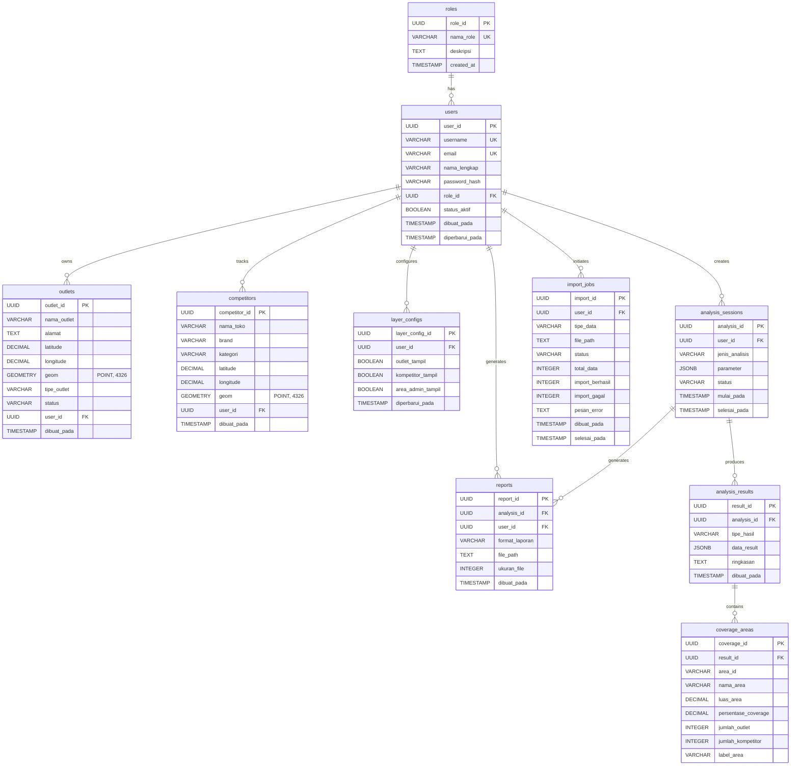

# Entity Relationship Diagram (ERD)

Document Name: Entity Relationship Diagram
Version: 1.0
Source Documents: docs/srs.md, docs/domain-model.md
Generated By: AI Assistant
Date: 2026-06-19

---

# 1. PostgreSQL/PostGIS Schema

Berikut adalah definisi tabel dalam PostgreSQL dengan ekstensi PostGIS untuk sistem WebGIS Analisis Sebaran Toko dan Pesaing.

## 1.1 Role Table

```sql
CREATE TABLE roles (
    role_id UUID PRIMARY KEY DEFAULT gen_random_uuid(),
    nama_role VARCHAR(50) NOT NULL UNIQUE,
    deskripsi TEXT,
    created_at TIMESTAMP NOT NULL DEFAULT NOW()
);

COMMENT ON TABLE roles IS 'Peran akses pengguna dalam sistem';
```

## 1.2 User Table

```sql
CREATE TABLE users (
    user_id UUID PRIMARY KEY DEFAULT gen_random_uuid(),
    username VARCHAR(100) NOT NULL UNIQUE,
    email VARCHAR(255) NOT NULL UNIQUE,
    nama_lengkap VARCHAR(255) NOT NULL,
    password_hash VARCHAR(255) NOT NULL,
    role_id UUID NOT NULL REFERENCES roles(role_id),
    status_aktif BOOLEAN NOT NULL DEFAULT true,
    dibuat_pada TIMESTAMP NOT NULL DEFAULT NOW(),
    diperbarui_pada TIMESTAMP NOT NULL DEFAULT NOW()
);

CREATE INDEX idx_users_role_id ON users(role_id);
CREATE INDEX idx_users_email ON users(email);
CREATE INDEX idx_users_username ON users(username);

COMMENT ON TABLE users IS 'User yang terdaftar dalam sistem';
```

## 1.3 Outlet Table

```sql
CREATE TABLE outlets (
    outlet_id UUID PRIMARY KEY DEFAULT gen_random_uuid(),
    nama_outlet VARCHAR(255) NOT NULL,
    alamat TEXT NOT NULL,
    latitude DECIMAL(10, 8) NOT NULL,
    longitude DECIMAL(11, 8) NOT NULL,
    geom GEOMETRY(POINT, 4326) NOT NULL,
    tipe_outlet VARCHAR(100) NOT NULL,
    status VARCHAR(20) NOT NULL CHECK (status IN ('AKTIF', 'TUTUP', 'RENOVASI')),
    user_id UUID NOT NULL REFERENCES users(user_id),
    dibuat_pada TIMESTAMP NOT NULL DEFAULT NOW()
);

CREATE INDEX idx_outlets_user_id ON outlets(user_id);
CREATE INDEX idx_outlets_geom ON outlets(geom);
CREATE INDEX idx_outlets_location ON outlets(latitude, longitude);

COMMENT ON TABLE outlets IS 'Outlet milik perusahaan yang dianalisis';
```

## 1.4 Competitor Table

```sql
CREATE TABLE competitors (
    competitor_id UUID PRIMARY KEY DEFAULT gen_random_uuid(),
    nama_toko VARCHAR(255) NOT NULL,
    brand VARCHAR(255) NOT NULL,
    kategori VARCHAR(100) NOT NULL,
    latitude DECIMAL(10, 8) NOT NULL,
    longitude DECIMAL(11, 8) NOT NULL,
    geom GEOMETRY(POINT, 4326) NOT NULL,
    user_id UUID NOT NULL REFERENCES users(user_id),
    dibuat_pada TIMESTAMP NOT NULL DEFAULT NOW()
);

CREATE INDEX idx_competitors_user_id ON competitors(user_id);
CREATE INDEX idx_competitors_geom ON competitors(geom);
CREATE INDEX idx_competitors_location ON competitors(latitude, longitude);

COMMENT ON TABLE competitors IS 'Kompetitor yang ada di pasaran';
```

## 1.5 LayerConfig Table

```sql
CREATE TABLE layer_configs (
    layer_config_id UUID PRIMARY KEY DEFAULT gen_random_uuid(),
    user_id UUID NOT NULL REFERENCES users(user_id),
    outlet_tampil BOOLEAN NOT NULL DEFAULT true,
    kompetitor_tampil BOOLEAN NOT NULL DEFAULT true,
    area_admin_tampil BOOLEAN NOT NULL DEFAULT false,
    diperbarui_pada TIMESTAMP NOT NULL DEFAULT NOW()
);

CREATE INDEX idx_layer_configs_user_id ON layer_configs(user_id);

COMMENT ON TABLE layer_configs IS 'Konfigurasi layer peta yang dapat diaktifkan/nonaktifkan';
```

## 1.6 AnalysisSession Table

```sql
CREATE TABLE analysis_sessions (
    analysis_id UUID PRIMARY KEY DEFAULT gen_random_uuid(),
    user_id UUID NOT NULL REFERENCES users(user_id),
    jenis_analisis VARCHAR(20) NOT NULL CHECK (jenis_analisis IN ('RADIUS', 'HEATMAP', 'COVERAGE', 'WHITESPOT', 'COMPETITOR')),
    parameter JSONB NOT NULL,
    status VARCHAR(20) NOT NULL DEFAULT 'PROSES' CHECK (status IN ('PROSES', 'SELESAI', 'GAGAL')),
    mulai_pada TIMESTAMP NOT NULL DEFAULT NOW(),
    selesai_pada TIMESTAMP
);

CREATE INDEX idx_analysis_sessions_user_id ON analysis_sessions(user_id);
CREATE INDEX idx_analysis_sessions_status ON analysis_sessions(status);

COMMENT ON TABLE analysis_sessions IS 'Sesi analisis yang dilakukan oleh pengguna';
```

## 1.7 AnalysisResult Table

```sql
CREATE TABLE analysis_results (
    result_id UUID PRIMARY KEY DEFAULT gen_random_uuid(),
    analysis_id UUID NOT NULL REFERENCES analysis_sessions(analysis_id),
    tipe_hasil VARCHAR(20) NOT NULL CHECK (tipe_hasil IN ('GEOJSON', 'STATISTIK', 'AREA')),
    data_result JSONB NOT NULL,
    ringkasan TEXT,
    dibuat_pada TIMESTAMP NOT NULL DEFAULT NOW()
);

CREATE INDEX idx_analysis_results_analysis_id ON analysis_results(analysis_id);

COMMENT ON TABLE analysis_results IS 'Hasil dari proses analisis spasial';
```

## 1.8 CoverageArea Table

```sql
CREATE TABLE coverage_areas (
    coverage_id UUID PRIMARY KEY DEFAULT gen_random_uuid(),
    result_id UUID NOT NULL REFERENCES analysis_results(result_id),
    area_id VARCHAR(100) NOT NULL,
    nama_area VARCHAR(255) NOT NULL,
    luas_area DECIMAL(12, 2),
    persentase_coverage DECIMAL(5, 2) NOT NULL,
    jumlah_outlet INTEGER NOT NULL DEFAULT 0,
    jumlah_kompetitor INTEGER NOT NULL DEFAULT 0,
    label_area VARCHAR(20) NOT NULL CHECK (label_area IN ('TERLAYANI', 'TIDAK_TERLAYANI'))
);

CREATE INDEX idx_coverage_areas_result_id ON coverage_areas(result_id);

COMMENT ON TABLE coverage_areas IS 'Area cakupan yang dihitung dari hasil analisis';
```

## 1.9 ImportJob Table

```sql
CREATE TABLE import_jobs (
    import_id UUID PRIMARY KEY DEFAULT gen_random_uuid(),
    user_id UUID NOT NULL REFERENCES users(user_id),
    tipe_data VARCHAR(20) NOT NULL CHECK (tipe_data IN ('OUTLET', 'COMPETITOR')),
    file_path TEXT NOT NULL,
    status VARCHAR(20) NOT NULL DEFAULT 'MENUNGGU' CHECK (status IN ('MENUNGGU', 'PROSES', 'SELESAI', 'GAGAL')),
    total_data INTEGER NOT NULL,
    import_berhasil INTEGER NOT NULL DEFAULT 0,
    import_gagal INTEGER NOT NULL DEFAULT 0,
    pesan_error TEXT,
    dibuat_pada TIMESTAMP NOT NULL DEFAULT NOW(),
    selesai_pada TIMESTAMP
);

CREATE INDEX idx_import_jobs_user_id ON import_jobs(user_id);
CREATE INDEX idx_import_jobs_status ON import_jobs(status);

COMMENT ON TABLE import_jobs IS 'Job untuk import data massal (CSV/Excel)';
```

## 1.10 Report Table

```sql
CREATE TABLE reports (
    report_id UUID PRIMARY KEY DEFAULT gen_random_uuid(),
    analysis_id UUID NOT NULL REFERENCES analysis_sessions(analysis_id),
    user_id UUID NOT NULL REFERENCES users(user_id),
    format_laporan VARCHAR(10) NOT NULL CHECK (format_laporan IN ('PDF', 'EXCEL')),
    file_path TEXT NOT NULL,
    ukuran_file INTEGER,
    dibuat_pada TIMESTAMP NOT NULL DEFAULT NOW()
);

CREATE INDEX idx_reports_analysis_id ON reports(analysis_id);
CREATE INDEX idx_reports_user_id ON reports(user_id);

COMMENT ON TABLE reports IS 'Laporan yang dihasilkan dari analisis';
```

---

# 2. Mermaid ER Diagram



---

# 3. Relationship Summary

| Relationship | Cardinality | Description |
|-------------|-------------|-------------|
| Role → User | 1 to Many | Satu role dapat dimiliki oleh banyak user |
| User → Outlet | 1 to Many | Satu user dapat memiliki banyak outlet |
| User → Competitor | 1 to Many | Satu user dapat memasukkan banyak kompetitor |
| User → LayerConfig | 1 to Many | Satu user dapat memiliki banyak konfigurasi layer |
| User → AnalysisSession | 1 to Many | Satu user dapat membuat banyak sesi analisis |
| User → ImportJob | 1 to Many | Satu user dapat membuat banyak job import |
| User → Report | 1 to Many | Satu user dapat membuat banyak laporan |
| AnalysisSession → AnalysisResult | 1 to Many | Satu sesi analisis dapat memiliki banyak hasil |
| AnalysisResult → CoverageArea | 1 to Many | Satu hasil analisis dapat memiliki banyak area coverage |
| AnalysisSession → Report | 1 to Many | Satu sesi analisis dapat menghasilkan banyak laporan |

---

# 4. Spatial Indexes

Untuk performa query spasial yang optimal, tabel `outlets` dan `competitors` menggunakan kolom `geom` dengan tipe `GEOMETRY(POINT, 4326)` untuk menyimpan data dalam sistem koordinat WGS84 (EPSG:4326).

```sql
-- Spatial index sudah didefinisikan pada masing-masing tabel
-- idx_outlets_geom dan idx_competitors_geom

-- Query contoh menggunakan PostGIS
-- Mencari outlet dalam radius 1km dari titik tertentu
SELECT * FROM outlets 
WHERE ST_DWithin(geom, ST_Point(106.8, -6.2)::geography, 1000);
```

---

# 5. Enum Values Reference

### Status Outlet
- `AKTIF` - Outlet aktif
- `TUTUP` - Outlet tutup
- `RENOVASI` - Outlet sedang renovasi

### Jenis Analisis
- `RADIUS` - Analisis radius jangkauan
- `HEATMAP` - Visualisasi kepadatan
- `COVERAGE` - Analisis cakupan area
- `WHITESPOT` - Identifikasi area potensial
- `COMPETITOR` - Analisis kompetitor

### Tipe Hasil
- `GEOJSON` - Hasil dalam format GeoJSON
- `STATISTIK` - Hasil statistik
- `AREA` - Hasil area coverage

### Status
- `PROSES` - Sedang diproses
- `SELESAI` - Selesai
- `GAGAL` - Gagal

### Format Laporan
- `PDF` - Laporan PDF
- `EXCEL` - Laporan Excel

### Label Area
- `TERLAYANI` - Area sudah terlayani
- `TIDAK_TERLAYANI` - Area belum terlayani

---

# 6. Traceability

ERD ini dihasilkan berdasarkan:

| Source | Reference |
|--------|-----------|
| SRS Section 5.1 | Data Entities specification |
| Domain Model Section 2 | Entity Detail |
| Domain Model Section 3 | Entity Relationship Diagram |
| SRS Section 6.3.3 | Database: PostgreSQL with PostGIS |