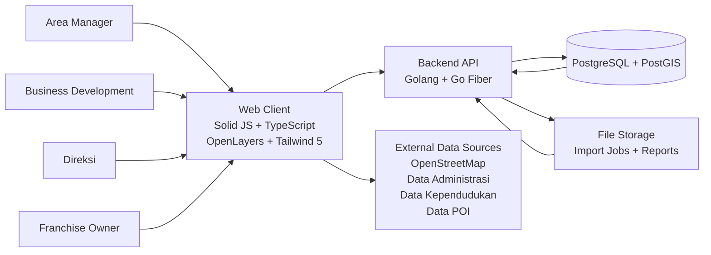
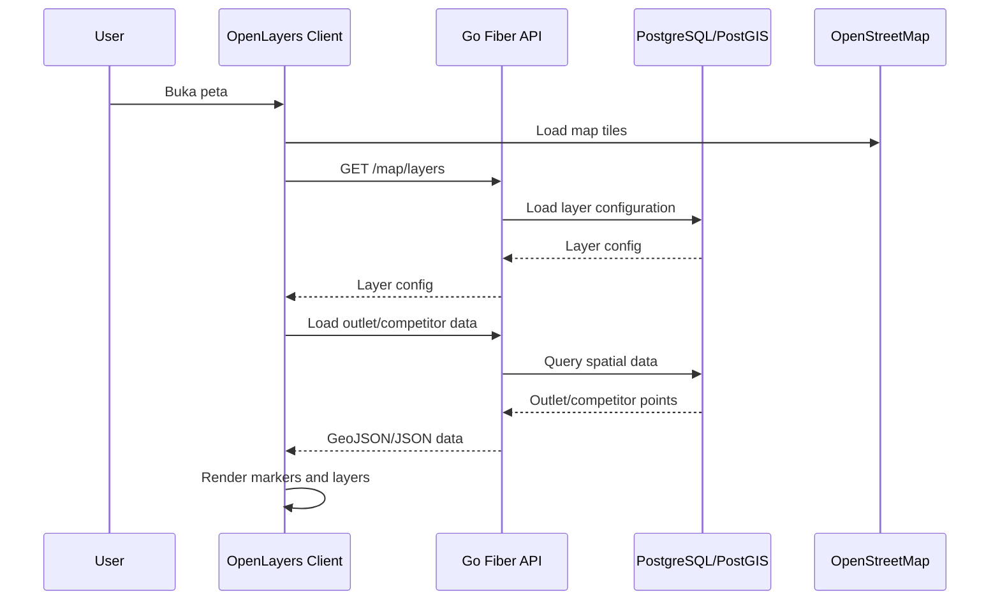
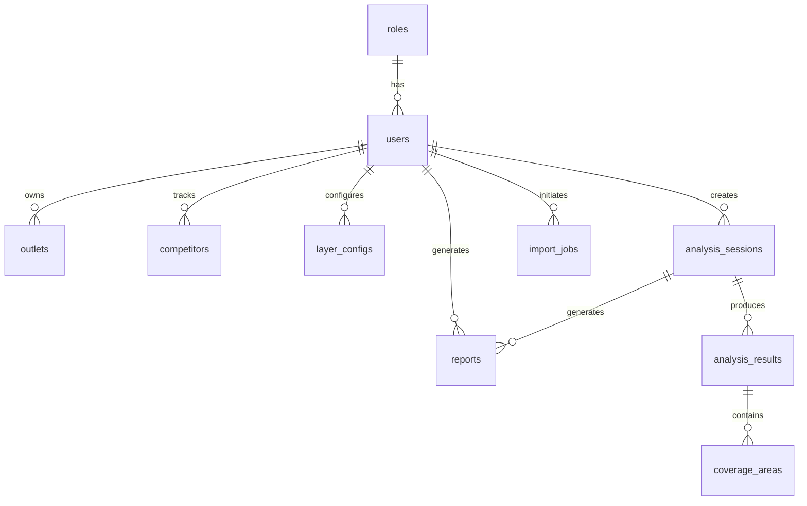
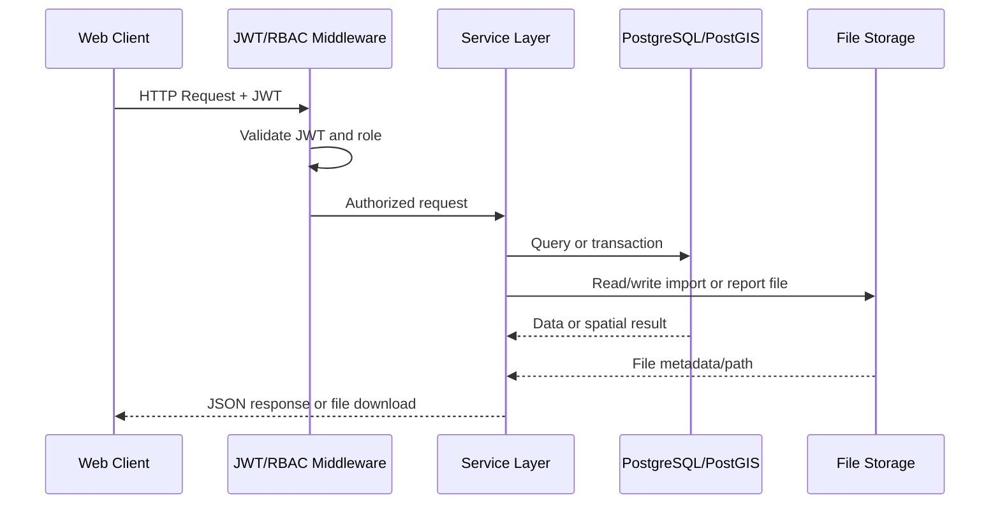
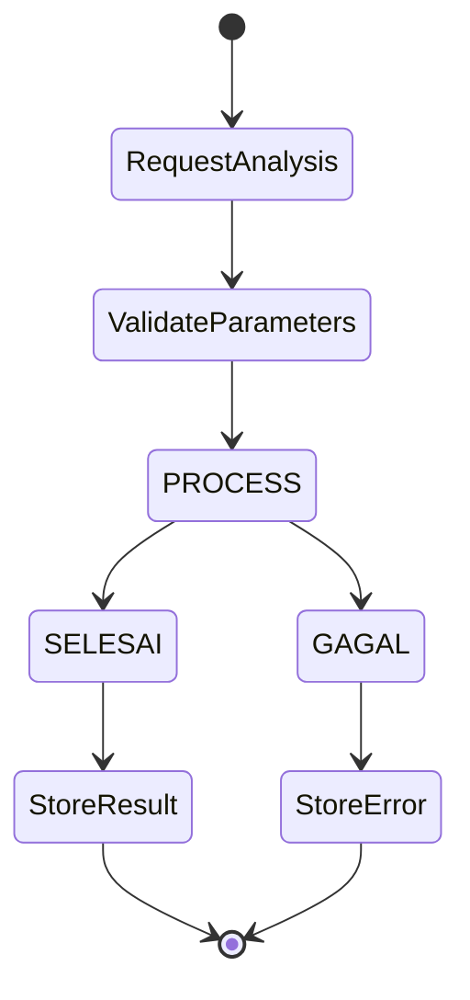
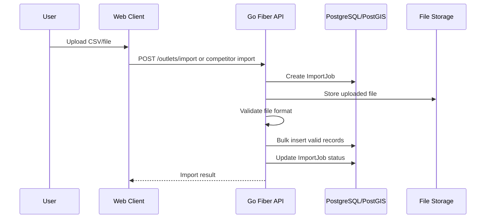
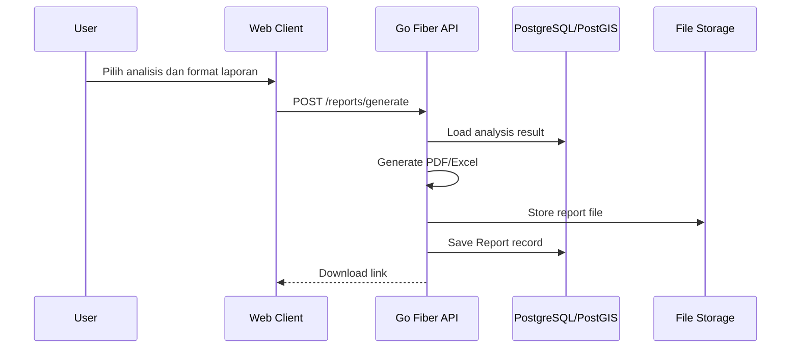

# System Architecture

Document Name: System Architecture  
Version: 1.0  
Unique ID: SA-001  
Source Documents: docs/ai-planning-spec.md, docs/srs.md, docs/erd.md  
Generated By: AI Assistant  
Date: 2026-06-19  

---

# 1. Architecture Overview

Sistem WebGIS Analisis Sebaran Toko dan Pesaing menggunakan arsitektur web berbasis client-server dengan pembagian utama:

1. **Frontend Web**
   - Solid JS
   - TypeScript
   - OpenLayers
   - Tailwind 5

2. **Backend API**
   - Golang
   - Go Fiber

3. **Database Spasial**
   - PostgreSQL
   - PostGIS

4. **Data dan File Storage**
   - Data outlet dan kompetitor
   - File import CSV/Excel
   - File laporan PDF/Excel
   - Hasil analisis GeoJSON, statistik, dan area

5. **External Data Sources**
   - OpenStreetMap
   - Data administrasi wilayah
   - Data kependudukan
   - Data POI

Arsitektur ini mendukung fitur MVP berdasarkan SRS: autentikasi, manajemen user, manajemen outlet, manajemen kompetitor, visualisasi peta GIS, analisis radius, coverage analysis, competitor analysis, heatmap, white spot analysis, dashboard analytics, dan reporting.

---

# 2. System Context Diagram

---

# 3. Layered Architecture

```mermaid
flowchart TB
    subgraph CLIENT[Client Layer]
        UI[UI Pages]
        MAP[GIS Map Components]
        DASH[Dashboard Components]
        FORM[Management Forms]
    end

    subgraph API[Application/API Layer]
        AUTH[Authentication Service]
        RBAC[RBAC Middleware]
        USER[User Management Service]
        OUTLET[Outlet Management Service]
        COMP[Competitor Management Service]
        MAPS[Map Layer Service]
        ANALYSIS[Spatial Analysis Service]
        DASHBOARD[Dashboard Analytics Service]
        REPORT[Reporting Service]
        IMPORT[Import Processing Service]
    end

    subgraph DATA[Data Layer]
        PG[(PostgreSQL)]
        GIS[PostGIS Spatial Engine]
        FILES[File Storage]
    end

    subgraph EXT[External Sources]
        OSM[OpenStreetMap]
        ADMIN[Data Administrasi Wilayah]
        DEMO[Data Kependudukan]
        POI[Data POI]
    end

    UI --> AUTH
    UI --> USER
    UI --> OUTLET
    UI --> COMP
    UI --> MAPS
    UI --> ANALYSIS
    UI --> DASHBOARD
    UI --> REPORT
    MAP --> OSM
    MAPS --> PG
    AUTH --> PG
    USER --> PG
    OUTLET --> PG
    COMP --> PG
    ANALYSIS --> GIS
    ANALYSIS --> PG
    DASHBOARD --> PG
    REPORT --> PG
    REPORT --> FILES
    IMPORT --> PG
    IMPORT --> FILES
```

---

# 4. Component Architecture

| Component ID | Component Name | Responsibility | Source |
|---|---|---|---|
| MOD-001 | Authentication | Login, logout, reset password, JWT issuance | SRS FR-001 |
| MOD-002 | User Management | CRUD user dan assignment role | SRS FR-002 |
| MOD-003 | Outlet Management | CRUD outlet dan import CSV outlet | SRS FR-003 |
| MOD-004 | Competitor Management | CRUD kompetitor dan import data kompetitor | SRS FR-004 |
| MOD-005 | GIS Map Visualization | Peta interaktif, marker, popup, layer visibility | SRS FR-005 |
| MOD-006 | Spatial Analysis | Radius, coverage, competitor, heatmap, dan white spot analysis | SRS FR-006 s/d FR-010 |
| MOD-007 | Dashboard Analytics | Statistik outlet, kompetitor, dan coverage | SRS FR-011 |
| MOD-008 | Reporting | Generate PDF dan Excel | SRS FR-012 |
| MOD-009 | Import Processing | Validasi dan proses import data massal | SRS FR-003, FR-004 |
| MOD-010 | Data Access & GIS Storage | Persistensi data relasional dan spasial | ERD Section 1 |
| MOD-011 | File Handling | Penyimpanan path file import dan laporan | ERD ImportJob, Report |

---

# 5. Frontend Architecture

## 5.1 Technology Stack

| Layer | Technology | Purpose |
|---|---|---|
| Framework | Solid JS | Rendering halaman dan state UI |
| Language | TypeScript | Type safety dan struktur kode frontend |
| GIS Library | OpenLayers | Peta interaktif, marker, layer, popup |
| Styling | Tailwind 5 | Desain antarmuka responsif |

## 5.2 Frontend Modules

| Module | Pages / Components | Related Requirement |
|---|---|---|
| Auth Module | Login, logout, reset password | FR-001 |
| User Management Module | Form CRUD user, role assignment | FR-002 |
| Outlet Management Module | Form CRUD outlet, import CSV outlet | FR-003 |
| Competitor Management Module | Form CRUD kompetitor, import kompetitor | FR-004 |
| GIS Map Module | Map canvas, marker outlet, marker kompetitor, popup, layer control | FR-005 |
| Analysis Module | Parameter form, map result, analysis result panel | FR-006 s/d FR-010 |
| Dashboard Module | Statistik, grafik coverage, tabel breakdown wilayah | FR-011 |
| Reporting Module | Generate report, download PDF/Excel | FR-012 |

## 5.3 Map Rendering Flow

---

# 6. Backend Architecture

## 6.1 Technology Stack

| Layer | Technology | Purpose |
|---|---|---|
| Language | Golang | Backend service implementation |
| Framework | Go Fiber | HTTP API routing, middleware, request handling |
| Database | PostgreSQL | Relational data storage |
| Spatial Engine | PostGIS | Spatial query, geometry, spatial index |

## 6.2 Backend Services

| Service | Main Responsibilities |
|---|---|
| Authentication Service | Validasi kredensial, JWT, logout, reset password |
| User Service | CRUD user, role assignment, password encryption |
| Outlet Service | CRUD outlet, validasi koordinat, import CSV |
| Competitor Service | CRUD kompetitor, validasi koordinat, import data |
| Map Service | Layer configuration dan data peta |
| Analysis Service | Radius, coverage, competitor, heatmap, white spot |
| Dashboard Service | Agregasi statistik dan metrik bisnis |
| Report Service | Generate PDF/Excel dan download link |
| Import Service | Validasi file, status job, import massal |

---

# 7. Data Architecture

## 7.1 Primary Database

Database utama menggunakan **PostgreSQL dengan PostGIS**. Data spasial outlet dan kompetitor disimpan dalam kolom `GEOMETRY(POINT, 4326)` menggunakan sistem koordinat WGS84.

## 7.2 Core Tables

| Table | Purpose | Spatial |
|---|---|---|
| `roles` | Role akses pengguna | No |
| `users` | Akun pengguna, role, status aktif | No |
| `outlets` | Data outlet perusahaan | Yes, `geom POINT` |
| `competitors` | Data kompetitor | Yes, `geom POINT` |
| `layer_configs` | Konfigurasi visibility layer peta | No |
| `analysis_sessions` | Sesi analisis pengguna | No |
| `analysis_results` | Hasil analisis GeoJSON/statistik/area | No |
| `coverage_areas` | Detail coverage per area | No |
| `import_jobs` | Status import data massal | No |
| `reports` | File laporan PDF/Excel | No |

## 7.3 Spatial Indexes

Tabel spasial menggunakan spatial index untuk mendukung query radius, overlap, dan analisis berbasis lokasi.

| Table | Spatial Column | Index |
|---|---|---|
| `outlets` | `geom` | `idx_outlets_geom` |
| `competitors` | `geom` | `idx_competitors_geom` |

## 7.4 Data Relationship Diagram

---

# 8. API Architecture

## 8.1 API Groups

| API Group | Endpoints | Module |
|---|---|---|
| Authentication | `POST /auth/login`, `POST /auth/logout`, `POST /auth/reset-password` | MOD-001 |
| User Management | `POST /users`, `GET /users`, `PUT /users/:id`, `DELETE /users/:id` | MOD-002 |
| Outlet Management | `POST /outlets`, `GET /outlets`, `PUT /outlets/:id`, `DELETE /outlets/:id`, `POST /outlets/import` | MOD-003, MOD-009 |
| Competitor Management | `POST /competitors`, `GET /competitors`, `PUT /competitors/:id`, `DELETE /competitors/:id` | MOD-004 |
| Map API | `GET /map/layers`, `PUT /map/layers` | MOD-005 |
| Analysis API | `POST /analysis/radius`, `GET /analysis/radius/:id`, `POST /analysis/coverage`, `GET /analysis/coverage/:id`, `POST /analysis/competitor`, `GET /analysis/competitor/:id`, `POST /analysis/heatmap`, `GET /analysis/heatmap/:id`, `POST /analysis/whitespot`, `GET /analysis/whitespot/:id` | MOD-006 |
| Dashboard API | `GET /dashboard/summary`, `GET /dashboard/outlet-stats`, `GET /dashboard/competitor-stats` | MOD-007 |
| Report API | `POST /reports/generate`, `GET /reports/:id/download` | MOD-008 |

## 8.2 API Request Flow

---

# 9. Security Architecture

## 9.1 Security Controls

| Control | Implementation Basis | Related Requirement |
|---|---|---|
| JWT Authentication | Token akses untuk request yang dilindungi | NFR-003 |
| RBAC | Role Admin, Manager, Analyst | NFR-003 |
| Password Hash | Password tidak disimpan dalam plain text | FR-002 |
| HTTPS | Semua komunikasi harus aman | NFR-003 |
| Input Validation | Validasi koordinat, CSV, dan input API | NFR-003 |
| Role Matrix | Pembatasan akses per fitur | SRS Section 8 |

## 9.2 RBAC Mapping

| Feature | Admin | Manager | Analyst |
|---|---|---|---|
| User Management | Yes | No | No |
| Outlet CRUD | Yes | Yes | No |
| Competitor CRUD | Yes | Yes | No |
| Analysis | Yes | Yes | Yes |
| Export | Yes | Yes | Yes |

---

# 10. Spatial Analysis Architecture

## 10.1 Analysis Session Pattern

Setiap proses analisis disimpan sebagai `analysis_sessions`. Hasil analisis disimpan dalam `analysis_results`, sedangkan detail area coverage disimpan dalam `coverage_areas`.

## 10.2 Analysis Types

| Analysis Type | Input | Processing | Output |
|---|---|---|---|
| Radius | Outlet ID/koordinat, radius, layer data | Buffer area, overlap, hitung outlet/kompetitor | Visualisasi radius, daftar titik, area overlap |
| Coverage | Outlet, area administrasi, parameter radius | Coverage percentage, luas coverage, klasifikasi area | Persentase coverage, luas km², visualisasi area |
| Competitor | Outlet, kompetitor, radius | Jarak terdekat, jumlah kompetitor, kepadatan | Ranking area dan metrik kompetitor |
| Heatmap | Layer outlet/kompetitor, intensitas | Density berdasarkan jumlah titik | Heatmap visualisasi |
| White Spot | Outlet, area administrasi, minimal outlet | Identifikasi area tanpa outlet, scoring potensi | Area potensial dan rekomendasi lokasi |

---

# 11. Reporting and Import Architecture

## 11.1 Import Flow

## 11.2 Report Flow

---

# 12. Deployment Architecture

## 12.1 Logical Deployment

| Deployment Unit | Components |
|---|---|
| Browser Client | Solid JS, TypeScript, OpenLayers, Tailwind 5 |
| Backend API | Golang, Go Fiber, JWT middleware, RBAC middleware, service modules |
| Database Server | PostgreSQL, PostGIS, spatial indexes |
| File Storage | Penyimpanan file import dan laporan berdasarkan `FilePath` |
| External Services | OpenStreetMap, data administrasi wilayah, data kependudukan, data POI |

## 12.2 Scalability Direction

Arsitektur dirancang untuk mendukung target skalabilitas SRS:

| Target | Architectural Support |
|---|---|
| Minimal 100.000 titik lokasi | PostgreSQL/PostGIS, `GEOMETRY(POINT, 4326)`, spatial index |
| Minimal 1.000 pengguna aktif bersamaan | Backend API modular, database indexing, query spasial teroptimasi |
| Peta terbuka < 3 detik | Layer configuration, map data query terfilter |
| Dashboard < 2 detik | Agregasi dashboard melalui API khusus |
| Query spasial < 5 detik | PostGIS spatial index dan query berbasis geometri |
| Uptime minimal 99% | Sistem harus dioperasikan dengan deployment yang menjaga ketersediaan layanan |

---

# 13. Quality Attribute Mapping

| Quality Attribute | Requirement | Architectural Response |
|---|---|---|
| Performance | Peta < 3 detik, dashboard < 2 detik, query spasial < 5 detik | PostGIS spatial index, modular API, layer filtering |
| Availability | Uptime minimal 99% | Deployment harus menjaga backend, database, dan file storage tetap tersedia |
| Security | JWT, HTTPS, RBAC, password encryption, input validation | Authentication middleware, role matrix, validation layer |
| Scalability | 100.000 titik lokasi, 1.000 pengguna aktif | PostgreSQL/PostGIS, indexed queries, stateless API design |
| Usability | Interface intuitif, error message jelas | Solid JS UI, OpenLayers map components, dashboard widgets |
| Maintainability | Codebase modular, dokumentasi teknis, logging | Service-based backend structure, documented modules, logging untuk debugging |

---

# 14. Constraints

| Constraint Type | Constraint |
|---|---|
| Technical | Frontend menggunakan Solid JS dan OpenLayers |
| Technical | Backend menggunakan Golang dan Go Fiber |
| Technical | Database menggunakan PostgreSQL dan PostGIS |
| Technical | Koordinat menggunakan format Decimal WGS84 |
| Business | MVP hanya mencakup fitur yang ada di PRD/SRS |
| Business | Tidak termasuk mobile application |
| Business | Tidak termasuk AI recommendation |
| Business | Tidak termasuk traffic prediction |
| Business | Tidak termasuk satellite image processing |
| Business | Tidak termasuk real-time vehicle tracking |
| Business | Tidak termasuk IoT integration |
| Regulatory | Data harus mematuhi regulasi privasi data lokal |
| Regulatory | Data geospatial harus menggunakan coordinate system yang sesuai |

---

# 15. Traceability Matrix

| Architecture Component | Related SRS Requirements | Related ERD Tables |
|---|---|---|
| MOD-001 Authentication | FR-001, NFR-003 | `roles`, `users` |
| MOD-002 User Management | FR-002 | `roles`, `users` |
| MOD-003 Outlet Management | FR-003 | `outlets` |
| MOD-004 Competitor Management | FR-004 | `competitors` |
| MOD-005 GIS Map Visualization | FR-005, NFR-001 | `layer_configs`, `outlets`, `competitors` |
| MOD-006 Spatial Analysis | FR-006 s/d FR-010 | `analysis_sessions`, `analysis_results`, `coverage_areas` |
| MOD-007 Dashboard Analytics | FR-011 | `outlets`, `competitors`, `analysis_results`, `coverage_areas` |
| MOD-008 Reporting | FR-012 | `reports`, `analysis_sessions` |
| MOD-009 Import Processing | FR-003, FR-004 | `import_jobs`, `outlets`, `competitors` |
| MOD-010 Data Access & GIS Storage | NFR-001, NFR-004 | `outlets`, `competitors` |
| MOD-011 File Handling | FR-003, FR-004, FR-012 | `import_jobs`, `reports` |

---

# 16. Document Control

## 16.1 Version History

| Version | Date | Author | Changes |
|---|---|---|---|
| 1.0 | 2026-06-19 | AI Assistant | Initial system architecture creation |

## 16.2 Traceability Declaration

Dokumen System Architecture ini dihasilkan berdasarkan:

- `docs/ai-planning-spec.md` untuk standar dokumen, unique ID, version, source document, dan traceability.
- `docs/srs.md` untuk kebutuhan fungsional, non-fungsional, API, role, teknologi, dan batasan sistem.
- `docs/erd.md` untuk struktur database, relasi entitas, spatial index, dan skema PostgreSQL/PostGIS.

Tidak ada fitur, entitas, endpoint, atau modul baru yang ditambahkan di luar dokumen sumber.
